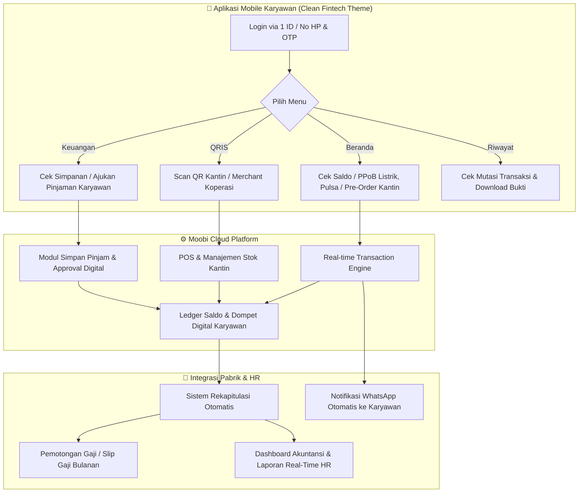

# Rancangan Sistem & Arsitektur Moobi Koperasi 2026
**Solusi Digital Koperasi Simpan Pinjam + Kantin Karyawan Terintegrasi Pabrik**
*PT Bakti Idola Tama • Didukung oleh Moobi Platform 2026*

---

## 1. Ringkasan Eksekutif & Modul Utama (Moobi Koperasi 2026)

| Modul Utama | Fitur Kunci | Integrasi Sistem |
| :--- | :--- | :--- |
| **Koperasi Digital** | Simpanan (Pokok, Wajib, Sukarela), Pengajuan & Persetujuan Pinjaman, Simulasi Cicilan, Akuntansi & Jurnal. | Terhubung langsung ke database karyawan pabrik & payroll. |
| **Kantin Digital** | POS Kasir Digital (Tablet/HP), Pre-Order Menu via App Karyawan, Deposit/Saldo Kantin, Manajemen Stok & Menu. | Transaksi 100% cashless via QRIS / Saldo Koperasi terpadu. |
| **PPoB & Pembayaran** | Pulsa/Paket Data, Token PLN, BPJS, PDAM, Internet/TV Kabel, Top-up e-Wallet. | Sistem tagihan & payment gateway / agregator PPoB. |
| **Payroll & HR Integration** | Rekap potongan simpanan, cicilan pinjaman, dan tagihan kantin otomatis memotong slip gaji bulanan. | Export/API sinkronisasi data ke HRMS / Payroll Pabrik. |

---

## 2. Rancangan Struktur File Proyek (Project Folder Structure)

Arsitektur sistem dirancang menggunakan pola **Monorepo / Clean Architecture** yang memisahkan antara **Aplikasi Mobile Karyawan** (React Native), **Backend API & Payroll Engine** (Node.js/Go/Laravel), serta **Web Dashboard Admin Koperasi & POS Kasir Kantin** (React/Next.js).

```bash
moobi-koperasi-ecosystem/
├── 📁 apps/
│   ├── 📱 mobile-karyawan/             # Aplikasi Mobile Karyawan (Clean Fintech UI)
│   │   ├── 📁 assets/
│   │   │   ├── 📁 icons/              # Ikon PPoB (PLN, Pulsa, BPJS, Kantin, QRIS, dll.)
│   │   │   ├── 📁 images/             # Banner Promo, Avatar, Ilustrasi
│   │   │   └── 📁 fonts/              # Typography (Plus Jakarta Sans / Inter)
│   │   ├── 📁 src/
│   │   │   ├── 📁 api/                # Axios Client, Interceptors, Endpoint definitions
│   │   │   │   ├── authApi.ts
│   │   │   │   ├── koperasiApi.ts     # API Simpanan & Pinjaman
│   │   │   │   ├── kantinApi.ts       # API Menu, Order, & POS
│   │   │   │   ├── ppobApi.ts         # API Pembayaran Tagihan & Pulsa
│   │   │   │   └── historyApi.ts      # API Riwayat Transaksi
│   │   │   ├── 📁 components/         # Reusable UI Atoms & Molecules
│   │   │   │   ├── 📁 common/         # Button, Badge, Modal, BottomSheet, InputField
│   │   │   │   ├── 📁 cards/          # BalanceCard, LoanCard, HistoryItemCard, MenuFoodCard
│   │   │   │   ├── 📁 navigation/     # Custom BottomBar (Beranda, Keuangan, QRIS, Riwayat, Profil)
│   │   │   │   └── 📁 widgets/        # DailyCheckIn, QuickReminderBanner, SecurityScore
│   │   │   ├── 📁 screens/            # Layar Utama sesuai Desain UI
│   │   │   │   ├── 📁 beranda/        # Tab 1: Beranda
│   │   │   │   │   ├── BerandaScreen.tsx
│   │   │   │   │   ├── components/GridMenuShortcuts.tsx
│   │   │   │   │   ├── components/ReminderWidget.tsx
│   │   │   │   │   ├── components/PromoBannerCarousel.tsx
│   │   │   │   │   └── components/PpobCategories.tsx
│   │   │   │   ├── 📁 keuangan/       # Tab 2: Keuangan
│   │   │   │   │   ├── KeuanganScreen.tsx
│   │   │   │   │   ├── components/SumberDanaSection.tsx      # Saldo Utama, Koin Reward, Plafon
│   │   │   │   │   ├── components/SimpananAsuransiSection.tsx # Wajib, Sukarela, BPJS
│   │   │   │   │   ├── components/PinjamanSection.tsx         # Pengajuan Pinjam s.d 25jt
│   │   │   │   │   └── components/KantinMerchantSection.tsx
│   │   │   │   ├── 📁 qris/           # Tab 3: Center Floating QRIS Scanner
│   │   │   │   │   ├── QrisScannerScreen.tsx
│   │   │   │   │   ├── QrisPaymentConfirmModal.tsx
│   │   │   │   │   └── GenerateMyQrScreen.tsx
│   │   │   │   ├── 📁 riwayat/        # Tab 4: Riwayat Transaksi
│   │   │   │   │   ├── RiwayatScreen.tsx
│   │   │   │   │   ├── components/FilterChips.tsx             # Filter Tanggal, Layanan, Metode
│   │   │   │   │   ├── components/TransactionGroupList.tsx
│   │   │   │   │   └── TransactionDetailScreen.tsx
│   │   │   │   ├── 📁 profil/         # Tab 5: Profil & Keamanan
│   │   │   │   │   ├── ProfilScreen.tsx
│   │   │   │   │   ├── components/UserBadgeCard.tsx
│   │   │   │   │   ├── components/AccountSecurityScore.tsx
│   │   │   │   │   └── EditProfileScreen.tsx
│   │   │   │   └── 📁 modules/        # Sub-fitur Detail
│   │   │   │       ├── 📁 pinjaman/   # Form Pengajuan Pinjaman, Simulasi Cicilan
│   │   │   │       ├── 📁 kantin/     # Pre-order Menu Kantin, Keranjang, Konfirmasi
│   │   │   │       └── 📁 ppob/       # Pembelian PLN, BPJS, Pulsa, TopUp
│   │   │   ├── 📁 hooks/              # Custom Hooks (useAuth, useWallet, useNotifications)
│   │   │   ├── 📁 store/              # State Management (Zustand / Redux Toolkit)
│   │   │   ├── 📁 theme/              # Colors, Spacing, Typography Tokens
│   │   │   └── 📁 utils/              # Formatter Rupiah, Date, JWT Helper
│   │   └── App.tsx
│   │
│   ├── 💻 web-admin-koperasi/          # Dashboard Manajemen Koperasi & HR Pabrik
│   │   ├── 📁 src/pages/
│   │   │   ├── 📁 dashboard/          # Ringkasan Omset Kantin, Pinjaman Berjalan, Total Simpanan
│   │   │   ├── 📁 anggota/            # Master Data Karyawan / 1 ID Integrasi
│   │   │   ├── 📁 simpan-pinjam/      # Approval Pengajuan Pinjaman, Buku Simpanan
│   │   │   ├── 📁 akuntansi/          # Jurnal Umum, Laba Rugi, Neraca, Arus Kas
│   │   │   ├── 📁 payroll-deduction/  # Rekap Potong Gaji Bulanan (Export Excel/PDF/API Payroll)
│   │   │   └── 📁 laporan/            # Laporan gabungan koperasi + kantin
│   │
│   └── 📟 web-pos-kantin/             # Web App Khusus Kasir Kantin (Mode Tablet/HP)
│       ├── 📁 src/pages/
│       │   ├── 📁 kasir/              # Mode Cepat Kasir: Scan QR Anggota / Barcode Menu
│       │   ├── 📁 pesanan-masuk/      # Antrean Pre-Order Karyawan
│       │   ├── 📁 stok-menu/          # Update Menu Harian, Harga, Stok & Alert Menipis
│       │   └── 📁 rekap-shift/        # Laporan Penjualan Per Shift Kasir
│
├── 📁 services/                       # Backend Microservices / Modular Monolith
│   ├── 📁 api-gateway/                # Routing, Rate Limiting, Authentication & Token
│   ├── 📁 auth-service/               # SSO 1 ID Karyawan, OTP, Role (Karyawan, Kasir, Pengurus, HR)
│   ├── 📁 core-koperasi-service/      # Ledger Simpan Pinjam, Bunga, Cicilan
│   ├── 📁 kantin-service/             # Katalog Menu, Inventory Stok, Order Processing
│   ├── 📁 payment-ppob-service/       # Switcher PPoB, QRIS Engine, Top-up Gateway
│   ├── 📁 payroll-sync-service/       # Integrasi Otomatis Potongan Gaji Karyawan Pabrik
│   └── 📁 notification-service/       # WhatsApp Gateway (Notif tagihan, approve pinjaman) & Push Notif
│
└── 📁 database/                       # Database Schema, Migrations & Seeds
    ├── 📁 migrations/
    │   ├── 001_create_users_karyawan.sql
    │   ├── 002_create_simpanan_table.sql
    │   ├── 003_create_pinjaman_angsuran.sql
    │   ├── 004_create_kantin_menu_orders.sql
    │   ├── 005_create_transaksi_ppob.sql
    │   ├── 006_create_payroll_deductions.sql
    │   └── 007_create_jurnal_akuntansi.sql
    └── schema_diagram.png
```

---

## 3. Alur Kerja Sistem (System & Business Flows)



### 1. Alur Transaksi Kantin Karyawan (Pre-order & Cashless POS)
1. **Pemesanan**: Karyawan membuka tab **Beranda / Kantin** di HP sebelum jam istirahat, memilih menu makanan/minuman, lalu *submit order*.
2. **Pembayaran Terintegrasi**: Saldo dipotong langsung dari Saldo Koperasi karyawan atau dicatat sebagai tagihan potong gaji bulanan.
3. **Notifikasi Kasir**: Kasir kantin menerima pesanan di layar POS Tablet, memproses makanan, dan memberikan pesanan saat jam istirahat tanpa antre tunai/kembalian.
4. **Rekap Stok**: Stok bahan & menu berkurang secara otomatis dan muncul laporan per shift.

### 2. Alur Pengajuan & Cicilan Pinjaman Koperasi
1. **Pengajuan**: Karyawan membuka tab **Keuangan ➔ Pinjaman**, memilih tenor dan nominal (plafon disesuaikan dengan masa kerja/gaji s.d Rp 25.000.000).
2. **Verifikasi & Approval**: Pengurus koperasi & HR menerima notifikasi digital di Dashboard Admin untuk memvalidasi limit dan menyetujui (*1-click approval*).
3. **Pencairan**: Dana langsung ditransfer ke rekening bank / masuk ke saldo dompet karyawan di aplikasi.
4. **Pelunasan**: Setiap periode penggajian, sistem menghitung angsuran pokok + jasa untuk dipotong langsung dari sistem payroll pabrik.

### 3. Alur PPoB & Pembayaran Tagihan
1. Karyawan memilih tagihan (PLN, Pulsa, BPJS, PDAM) di tab **Beranda / Pembayaran**.
2. Pembayaran diselesaikan menggunakan saldo koperasi dengan benefit poin reward *cashback*.
3. Notifikasi bukti struk digital otomatis masuk ke tab **Riwayat** dan WhatsApp karyawan.

---

## 4. Pemetaan Tampilan UI Desain ke Fitur Koperasi

| Tab UI | Komponen Visual di Desain | Fitur Moobi Koperasi yang Diimplementasikan |
| :--- | :--- | :--- |
| **1. Beranda** | • Header Saldo & Tombol Topup/Tarik/Transfer<br>• Pengingat Widget (PLN Pascabayar)<br>• Grid Icons: PLN, Pulsa, Data, Kantin, PPoB<br>• Daily Check-in Coins & Promo Banners | • Saldo Koperasi Karyawan + Notifikasi angsuran jatuh tempo.<br>• Menu cepat order kantin, token PLN, bayar BPJS.<br>• Program loyalitas & poin keaktifan anggota koperasi. |
| **2. Keuangan** | • Sumber Dana: Saldo Utama, Koin, Paylater<br>• Simpanan & Asuransi: Emas, Asuransi<br>• Pinjaman: Plafon pinjam s.d 25 Juta & BPKB<br>• Kantin & Merchant: QRIS Jualan | • Saldo Simpanan Sukarela, Koin Koperasi, Plafon Pinjaman.<br>• Simpanan Pokok & Wajib, Asuransi BPJS TK.<br>• Form Pengajuan Pinjaman Karyawan & simulasi angsuran.<br>• Saldo belanja kantin karyawan & QRIS merchant. |
| **3. QRIS** | • Floating Center Action Button | • Fitur scan bayar di kasir kantin pabrik 100% cashless & transfer cepat antar anggota koperasi. |
| **4. Riwayat** | • Filter [Tanggal], [Layanan], [Metode]<br>• Mutasi Timeline: Pembayaran, Top Up, Potong Gaji<br>• Tombol Download Laporan | • Riwayat transaksi PPoB, belanja kantin, cicilan pinjaman, serta simpanan rutin yang dapat di-export ke PDF. |
| **5. Profil** | • User Badge (Nama & No ID Karyawan)<br>• Perlindungan Akun & Skor Keamanan 100%<br>• Pengaturan Akun, Bantuan, & Logout | • Profil keanggotaan koperasi pabrik, nomor induk karyawan (NIK), status verifikasi, dan bantuan CS Koperasi 24 jam. |

---

## 5. Rekomendasi Langkah Selanjutnya

1. **Pembuatan Prototype Frontend Mobile**: Membangun komponen UI dasar bertema Clean Fintech Theme menggunakan React Native / Expo dengan 5 navigation tab di atas.
2. **Setup Mock Data & Schema Database**: Menyiapkan tabel relasi Simpan-Pinjam, Menu Kantin, dan Sinkronisasi Potong Gaji HR.
3. **Integrasi POS Kasir**: Menyiapkan antarmuka web kasir kantin untuk membaca QRIS dan order karyawan secara real-time.
